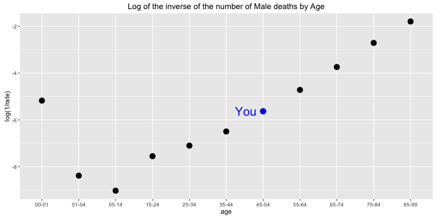
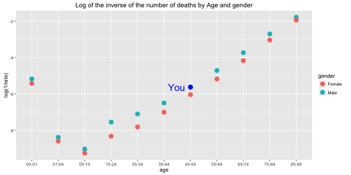
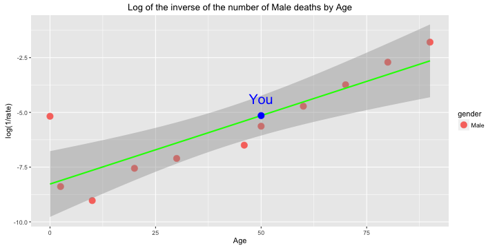

## Overview of the app

* We give death rates little attention on our daily lives, except when they are forced on us by some catastrophe, societal or personal.
* It is useful to be reminded of the major effects on death rates - namely our sex, and our age.
* The shiny app built does the following analysis for specific user given age and gender:
 * Age effects
 * Gender effects
 * Prediction from Linear Model
* Link for the app: https://ricardosc.shinyapps.io/DevDataProd/
* Data were taken from UK national mortality statistics
 * http://www.medicine.ox.ac.uk/bandolier/booth/Risk/dyingage.html

--- .class #id

## Age

* Historical data shows that, generally, for any gender, the older you get, the greater is your risk of dying in any one year, so we have to be careful.
* Our app, for a gender given by the user (labeled as __You__), shows how the age affects death risk, as on the following plot:

--- .class #id 

## Gender

* Additionally, our app gives a gender analysis for death risk specific for the user (labeled as __You__), as in the following plot:

* Although, that gender analysis is too simplistic. Therefore, our app takes a Two Sample T-Test, which gives a p-value of 0.605, stating that we cannot affirm, with the data available, that there is a significant difference in risk for gender.

--- .class #id 

## Linear Model

* Using a linear regression for death risk, our app shows the predictive model, along with the user data (labeled as __You__) and the original data.
* The linear model is as close as possible to the points, but it may produce different risks than the original data points. Our app shows how the predicted risk compares to the original risk for the user, as in the image:

